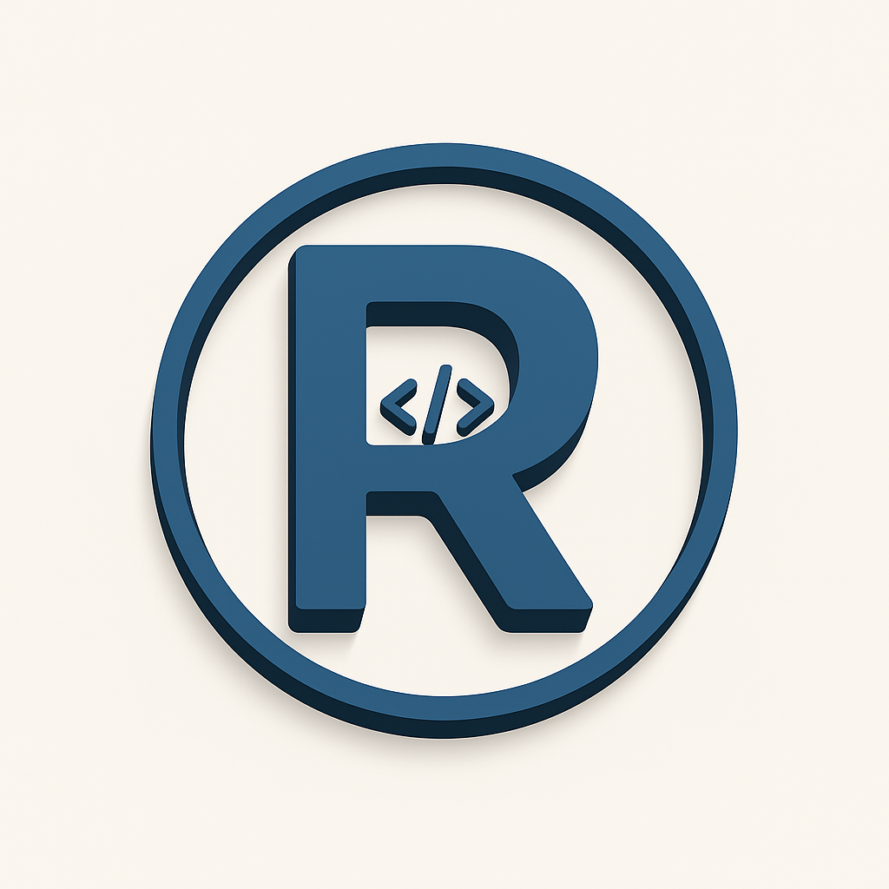

<div align="center">
  
</div>

<br>
<p align="center">
  Animated Portfolio
</p>
<p align="center">
  crafted with <span style="color: #8b0000;">&hearts;</span> by <a href="https://risdylabs.my.id">Risdy Labs</a>.
</p>

> RisdyLabs' Developer Portfolio built on NextJS

## Built With

This website is built with <span style="color: #8b0000;">&hearts;</span> on [NextJS](https://nextjs.org/), statically typed in [TypeScript](https://www.typescriptlang.org/), and [Tailwind](https://tailwindcss.com/).

## Installation 🔧

Install dependencies

```
$ yarn
```

Building

```
$ yarn build
```

## Running Server 🚀

Start the development server

```
$ yarn dev
```

Start the server

```
$ yarn start
```

## License 📜

`Portfolio` is available under the MIT license. See the LICENSE file for more info.

## Forking this repo 🚨

You can use this code for your own websites with credits. Please don't hesitate to ask me if any doubt.

I love keep it open source, but as you all know, _**plagiarism is bad**_. I spent a non-negligible amount of effort developing, designing, and trying to perfect this website, and I am proud of it! All I ask is to not claim this effort as your own.
